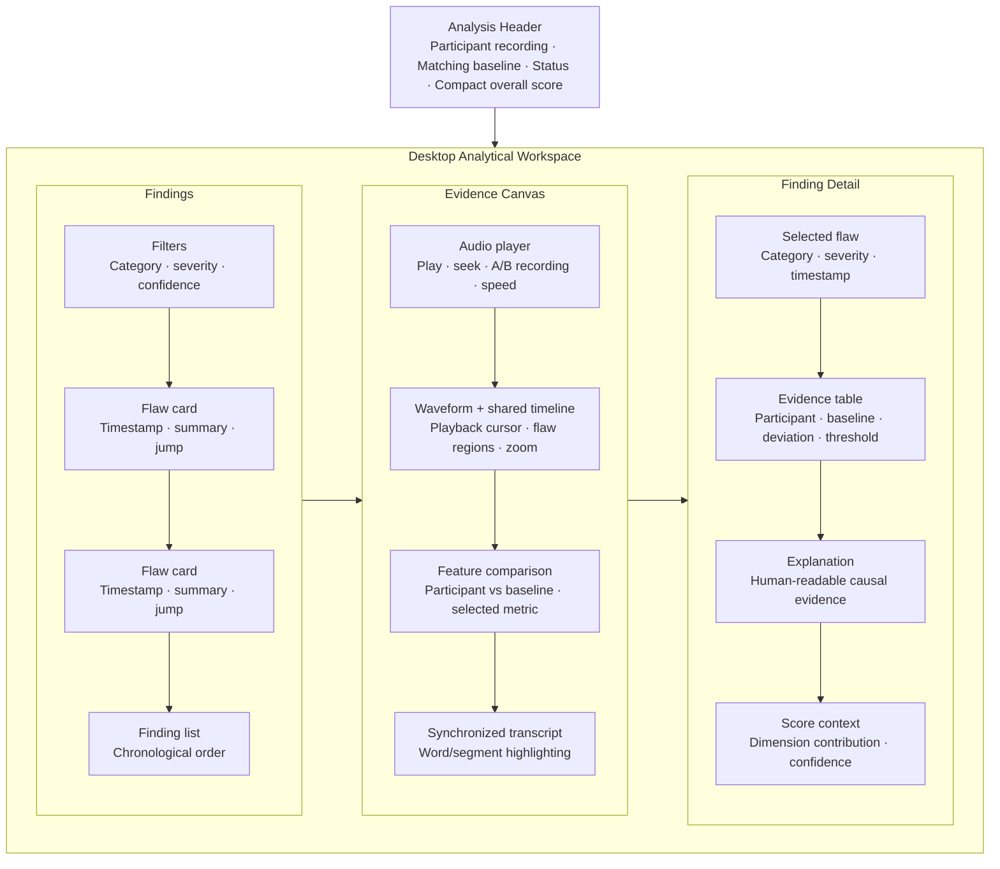

# Design Specification

## Contrastive Speech Analytics & Temporal Flaw Grounding

**Document:** `design.md`  
**Status:** Engineering-ready UI/UX specification  
**Design objective:** Make the analytical chain immediately legible:

> **DATA → ALIGN → ANALYZE → GROUND → EXPLAIN → SCORE**

This design describes a serious speech-analysis laboratory rather than a generic AI dashboard. The interface must make seven questions easy to answer:

1. What participant audio was analyzed?
2. What aligned baseline was used?
3. What was measured?
4. Where did the participant deviate?
5. Why was that deviation classified as a flaw?
6. What numerical evidence supports the finding?
7. What score resulted from the evidence?

The visual system prioritizes waveform, timeline, comparison charts, transcript synchronization, and evidence cards. It intentionally avoids decorative complexity that competes with the acoustic analysis.

---

## 1. Design Principles

### 1.1 Evidence before score

The score is an output summary, not the primary visual object. The waveform, aligned baseline comparison, temporal finding, transcript, and numerical evidence should remain visually available when a score is shown.

### 1.2 Contrastive by default

The selected participant recording and matching baseline must be visible together. The interface must not make a generic quality judgment look equivalent to a same-text baseline comparison.

### 1.3 Time is a first-class dimension

Every important finding is navigable in time. Selecting a flaw synchronizes the waveform, chart overlays, transcript, timeline marker, playback position, and detail panel.

### 1.4 Technical but understandable

Show the feature name, unit, baseline value, participant value, deviation, threshold, and confidence. Pair technical evidence with a short human explanation. Provide optional detail rather than hiding evidence behind unexplained labels.

### 1.5 Calm analytical density

The workspace may be information-dense, but it must be organized into clear regions, strong hierarchy, and consistent spacing. Dense information is preferable to oversized decorative cards.

### 1.6 Honest uncertainty

Low alignment confidence, missing features, unavailable dimensions, and excluded regions must be visible. The design must never create false confidence through a polished but incomplete chart.

### 1.7 Accessible interaction

All major interactions must work by keyboard, have semantic labels, provide visible focus, and communicate meaning without color alone.

---

## 2. Visual Direction

### 2.1 Overall aesthetic

Use a modern dark analytical interface with:

- Deep neutral background.
- Slightly lighter surface layers.
- Restrained accent colors.
- Strong typographic hierarchy.
- Fine borders and subtle dividers.
- Waveform and data visualization as the visual focus.
- Minimal unnecessary decoration.

The product should feel closer to a scientific workstation or audio post-production analysis tool than to a marketing dashboard.

### 2.2 Avoid

Do not use:

- Excessive gradients.
- Glassmorphism.
- Giant glowing cards.
- Decorative animations that compete with playback or charts.
- Large hero sections that push evidence below the fold.
- Unlabeled “AI insight” panels.
- Color-only flaw semantics.
- Score visual treatments that overpower the comparison evidence.

### 2.3 Visual hierarchy

The hierarchy should generally be:

1. Recording/baseline identity and analysis status.
2. Waveform, timeline, and selected region.
3. Feature comparison and transcript evidence.
4. Finding explanation and numerical evidence.
5. Score summary and rubric contribution.
6. Metadata and configuration details.

---

## 3. Information Architecture

The application has eight primary sections:

| Section | Purpose | Primary content |
|---|---|---|
| **Dashboard** | Entry point and recent work | Recent analyses, status, quick actions, dataset health |
| **Analyze Speech** | Guided input flow | Audio upload, transcript, baseline selection, processing |
| **Dataset** | Inspect contrastive examples | Sample ID, paired recordings, labels, timestamps, metadata, validation |
| **Analysis Results** | Review a completed run | Score summary, findings, evidence, explanation, export |
| **Timeline** | Inspect all findings temporally | Waveform, markers, transcript alignment, region navigation |
| **Feature Comparison** | Compare acoustic dimensions | Participant/baseline overlays for F0, energy, rate, MFCC, pauses, clarity |
| **Scoring** | Explain rubric output | Category scores, weights, contributions, evidence, rubric version |
| **Settings / Configuration** | Inspect analysis behavior | Rubric, thresholds, preprocessing, feature and display preferences |

### 3.1 Global navigation

The left navigation rail is persistent on desktop and collapses into a labeled menu on smaller screens. The active section uses an accent border and text treatment, not color alone.

The global header contains:

- Product name and current project/run context.
- Navigation toggle.
- Current analysis ID when applicable.
- Help or documentation link.
- User/session menu only if supported by the deployment.

### 3.2 Dashboard landing view

The dashboard should show:

- **Analyze new speech** primary action.
- Recent analysis runs with status, recording name, baseline name, date, and overall score.
- A compact pipeline status summary: data, alignment, analysis, grounding, explanation, score.
- Dataset validation summary, such as paired samples available and samples requiring review.
- A short explanation of the product’s same-text baseline principle for first-time users.

The dashboard must not imply that an overall score is meaningful without baseline and alignment status.

---

## 4. Core Analysis Screen

The analysis screen is the main product surface. It combines identity, status, audio, time-series evidence, transcript, findings, and score context.

### 4.1 Header

The header must show:

- Participant recording name.
- Baseline recording name.
- Transcript/sample ID.
- Analysis status: processing, complete, warning, or failed.
- Alignment confidence/coverage indicator.
- Overall score in a compact, secondary treatment.
- Export/report action when the run is complete.

Example:

```text
Participant: round-07.wav        Baseline: transcript-014-ideal.wav
Transcript: T-014                Status: Complete · Alignment 96%
                                                     Overall 78 / 100
```

The score should be visually restrained. It may use a compact number and label, but the evidence workspace must occupy more visual weight.

### 4.2 Main analytical workspace

The desktop layout uses three columns where appropriate:

- **Left:** Finding list and filters.
- **Center:** Audio player, waveform, timeline, transcript, and selected feature chart.
- **Right:** Finding detail, numerical evidence, explanation, and score context.

The layout must be resizable or gracefully collapse if implementation permits. A fixed minimum width must prevent charts from becoming unreadable.

### 4.3 Audio player

The audio player must support:

- Play/pause.
- Current time and total duration.
- Seek/scrub.
- Skip to selected finding.
- Playback speed.
- Participant/baseline selector or clearly labeled A/B control.
- Volume/mute.
- Keyboard shortcuts with visible labels or accessible descriptions.

The player must indicate which recording is currently playing. A selected finding should start playback at the finding’s beginning.

### 4.4 Waveform and timeline

The waveform is the primary visual anchor.

Required behavior:

- Show time in seconds.
- Show the participant waveform and baseline reference clearly.
- Mark flaw regions with non-color cues such as patterned overlay, border, label, or icon.
- Show a playback cursor.
- Show selected-region boundaries.
- Support zoom or time-range navigation.
- Allow clicking a region to select and inspect it.
- Keep the transcript and feature chart on the same time coordinate system.
- Show low-confidence or excluded regions with a distinct hatch or muted treatment.

The timeline should make the sequence of findings understandable at a glance. Marker density must be managed for long recordings; overlapping markers may be grouped with a count while remaining individually accessible.

### 4.5 Feature panel

The feature selector includes:

- Pitch / F0.
- Energy.
- Speech rate.
- MFCC.
- Pause intervals.
- Vocal clarity.

A selected feature chart shows participant and baseline traces or aligned summary marks, with:

- Shared time axis.
- Legend that does not rely on color alone.
- Unit and feature definition.
- Threshold/reference bands where applicable.
- Highlighted selected finding region.
- Tooltips with timestamp, participant value, baseline value, deviation, and unit.
- Empty/unsupported state when the feature is unavailable.

The chart must not show a line without explaining what it measures.

### 4.6 Transcript view

The transcript is synchronized with timestamps and should appear beneath or adjacent to the waveform, depending on viewport width.

Required behavior:

- Display canonical or human-readable transcript text according to the design system.
- Highlight the current word/segment during playback.
- Highlight words associated with the selected flaw.
- Allow clicking a word/segment to seek playback.
- Show alignment uncertainty at the affected unit when applicable.
- Preserve readable line lengths and avoid excessive horizontal scrolling on desktop.

A selected transcript region must update the associated finding detail when one exists.

---

## 5. Finding List and Flaw Cards

### 5.1 Finding list

The left panel displays findings in chronological order by default. Filters include:

- Flaw category.
- Severity.
- Scored vs diagnostic-only.
- Confidence.
- Feature.

The list header shows total findings and the number excluded or low-confidence. A clear empty state must distinguish “no findings detected” from “analysis has not completed” and “no valid evidence available.”

### 5.2 Flaw card

Every flaw card contains:

- Flaw type.
- Severity label and non-color indicator.
- Timestamp range.
- Short human explanation.
- Numerical evidence summary.
- Confidence/coverage indicator.
- **Jump to region** action.

Example:

```text
Pacing deviation                 MODERATE
00:18.42–00:21.10
Speech rate increased 29.7% relative to the aligned baseline.
3.10 → 4.02 words/second · confidence 0.91
[Jump to region]
```

Cards must not use “bad,” “weak,” or personality-based labels. Use the configured flaw taxonomy.

### 5.3 Selected flaw state

When selected, the card receives a visible focus/selection border, the timeline region is emphasized, playback seeks to the start, and the right detail panel updates. Selection must be communicated by more than a color change.

---

## 6. Finding Detail and Explainability Panel

The detail panel must answer why a region was classified as a flaw.

### 6.1 Required content

- Category and severity.
- Timestamp range.
- Affected transcript text.
- Feature name and definition.
- Participant value.
- Baseline value.
- Deviation and unit.
- Configured threshold.
- Detection confidence.
- Alignment confidence.
- Mathematical evidence, expandable for detail.
- Human-readable explanation.
- Limitation or uncertainty note when relevant.

### 6.2 Evidence layout

Use a compact comparison table rather than forcing users to infer values from a chart:

| Evidence | Participant | Baseline | Difference |
|---|---:|---:|---:|
| Speech rate | 4.02 words/s | 3.10 words/s | +29.7% |
| Region | 18.42–21.10 s | 18.42–21.10 s | aligned |
| Threshold | — | — | 20.0% |
| Confidence | 0.91 | 0.96 alignment | — |

The exact fields depend on the feature, but units must always be visible.

### 6.3 Explanation treatment

Display a short explanation first, followed by an optional **How this was determined** disclosure. The disclosure should show the formula or comparison rule in plain language and preserve the raw values used.

Example:

> Speech rate increased from **3.10** to **4.02 words/second** (**+29.7%**) relative to the aligned baseline. This compressed the timing around the affected phrase. The finding exceeded the configured **20%** threshold.

Add a limitation note:

> This is a measured timing deviation. It does not infer why the speaker produced it.

---

## 7. Scoring View

The scoring view explains the result without making the number visually dominate the evidence.

### 7.1 Required content

- Overall score.
- Category/dimension scores.
- Weighted contribution of each dimension.
- Evidence supporting each dimension.
- Finding count and confidence/coverage.
- Rubric configuration/version.
- Missing or unavailable dimensions.

### 7.2 Score visualization

Use a compact summary block and a breakdown table or horizontal bars. Avoid a giant circular gauge as the primary content.

Example:

| Dimension | Score | Weight | Contribution | Evidence |
|---|---:|---:|---:|---|
| Pacing | 68 | 25% | 17.0 | 2 grounded findings |
| Pause control | 82 | 20% | 16.4 | 1 grounded finding |
| Pitch variation | 76 | 15% | 11.4 | 92% voiced coverage |
| Energy dynamics | 84 | 15% | 12.6 | No threshold breach |
| Vocal clarity | 79 | 15% | 11.9 | Valid MFCC/spectral evidence |
| Consistency | 72 | 10% | 7.2 | 3 aligned regions |

### 7.3 Score caveats

If a dimension is unavailable or has insufficient evidence:

- Show `Unavailable` or `Insufficient coverage`, not zero or 100.
- Explain why.
- Show how the overall score handled the missing dimension.
- Expose rubric version and configuration identifier.

---

## 8. Dataset View

The Dataset section is an engineering and evaluation view, not a generic media library.

### 8.1 Table fields

Show:

- Sample ID.
- Transcript or transcript ID.
- Baseline recording.
- Flawed recording.
- Flaw category.
- Severity.
- Timestamp range.
- Speaker pseudonymous ID where permitted.
- Dataset split.
- Metadata summary.
- Validation status.

### 8.2 Dataset detail

A sample detail view should show the paired recordings, exact transcript match status, flaw annotations on the timeline, provenance, annotation/review status, and validation warnings.

Use status labels such as:

- `Validated`.
- `Needs review`.
- `Transcript mismatch`.
- `Missing timestamps`.
- `Low audio quality`.
- `Excluded from evaluation`.

The UI must never make incomplete samples look production-ready.

---

## 9. Upload and Analysis Flow

The upload experience is a five-step guided flow.

### Step 1 — Upload audio

Show a dropzone and file picker with supported formats, size/duration constraints, and privacy/retention note. After upload, display filename, duration, sample rate, channels, and validation status.

### Step 2 — Add or verify transcript

Allow paste or file input. Show normalized text preview and any validation warnings. Make the transcript visibly editable before alignment.

### Step 3 — Select baseline

Offer exact transcript matches first. Display baseline name, transcript ID, duration, and validation status. Do not show an unrelated baseline as a valid match.

### Step 4 — Process

Show the pipeline progress state described below. Preserve the run ID and allow the user to understand the current stage.

### Step 5 — Review analysis

Open the analysis screen with alignment coverage, overall status, findings, waveform, transcript, feature panel, and score context. If the run has warnings, show them before or alongside the findings.

### Flow navigation

- Users can move backward to correct audio, transcript, or baseline selection before processing.
- Once processing begins, show whether a restart is required after an input change.
- Preserve valid input metadata across steps.
- Use clear primary and secondary actions.
- Do not hide blocking validation errors inside a toast that disappears.

---

## 10. Processing State

Processing status communicates the chain:

> **DATA → ALIGN → ANALYZE → GROUND → EXPLAIN → SCORE**

Show these meaningful progress steps:

1. **Audio validated**
2. **Transcript aligned**
3. **Features extracted**
4. **Baseline normalized**
5. **Deviations detected**
6. **Flaws grounded**
7. **Explanation generated**
8. **Score calculated**

### 10.1 Step status conventions

| Status | Visual treatment | Meaning |
|---|---|---|
| Pending | Muted icon and label | Not started |
| In progress | Accent indicator and restrained motion | Currently processing |
| Complete | Checkmark plus text label | Successfully completed |
| Warning | Warning icon plus explanatory text | Completed with limitation |
| Failed | Error icon plus recovery text | Cannot continue or result is invalid |
| Skipped | Muted label with reason | Not applicable or excluded by configuration |

Never use animation alone to communicate progress. Always provide text.

### 10.2 Processing failure

A failed stage must show:

- Stage name.
- Plain-language error.
- Whether the input can be corrected.
- Retry or return action.
- Run ID for diagnostics.

---

## 11. Responsive Design

### 11.1 Desktop

Use a three-column analytical workspace where appropriate:

- Left: findings and filters.
- Center: waveform, timeline, transcript, feature comparison.
- Right: evidence, explanation, and score context.

Desktop charts should use a shared time axis and preserve enough horizontal space for labels and tooltips.

### 11.2 Tablet

Use a two-column layout:

- Primary column: waveform, timeline, transcript, and selected feature chart.
- Secondary column: collapsible findings and evidence panel.

The evidence panel may become a bottom sheet or tabbed region when width is constrained. Do not shrink chart labels below readable sizes.

### 11.3 Mobile

Use stacked cards with this order:

1. Recording/baseline/status header.
2. Compact score and coverage summary.
3. Fixed audio controls.
4. Waveform and timeline.
5. Finding list.
6. Selected finding evidence and explanation.
7. Transcript.
8. Feature comparison.
9. Score breakdown and rubric.

Requirements:

- Fixed or sticky audio controls that do not cover transcript content.
- Horizontally scrollable charts where required, with visible scroll affordance.
- No inaccessible tiny charts.
- Finding cards remain readable and actionable.
- Use accordions for long technical evidence.
- Preserve jump-to-region behavior.

### 11.4 Breakpoint behavior

The implementation should define breakpoints through design tokens rather than scattering pixel values across components. The exact breakpoint values may be selected by the frontend implementation, but behavior must match the desktop/tablet/mobile rules above.

---

## 12. Design Tokens

The following tokens form the initial visual contract. Values may be implemented as CSS variables, theme tokens, or an equivalent system.

### 12.1 Color tokens

| Token | Suggested value | Use |
|---|---|---|
| `color.bg.canvas` | `#0B0F14` | Deep application background |
| `color.bg.surface` | `#111820` | Primary panels and cards |
| `color.bg.surfaceRaised` | `#17212B` | Selected or raised panel |
| `color.bg.surfaceMuted` | `#0F151C` | Input areas and subdued regions |
| `color.border.default` | `#263442` | Dividers and panel borders |
| `color.border.strong` | `#3A4B5B` | Focused or selected borders |
| `color.text.primary` | `#F2F5F7` | Main text |
| `color.text.secondary` | `#AAB7C4` | Supporting text |
| `color.text.muted` | `#718092` | Metadata and inactive states |
| `color.accent.primary` | `#5CC8FF` | Interactive emphasis, baseline reference |
| `color.accent.secondary` | `#B59CFF` | Participant reference or secondary analysis |
| `color.status.success` | `#63D39B` | Completed/valid status |
| `color.status.warning` | `#F1C56B` | Warning/low confidence |
| `color.status.error` | `#F27C83` | Failure/blocking error |
| `color.finding.pacing` | `#F1A45C` | Pacing marker |
| `color.finding.pause` | `#D69CFF` | Pause-control marker |
| `color.finding.pitch` | `#65D5C1` | Pitch marker |
| `color.finding.energy` | `#F27C83` | Energy marker |
| `color.finding.clarity` | `#8EB5FF` | Clarity marker |

Color is always paired with labels, patterns, icons, or line styles.

### 12.2 Typography

Use a clear sans-serif UI font with tabular numerals for measurements. A monospace face may be used for IDs, timestamps, formulas, and raw values.

| Token | Suggested size/line height | Use |
|---|---|---|
| `type.display` | 28/34 | Page title, used sparingly |
| `type.heading1` | 22/28 | Primary section heading |
| `type.heading2` | 17/23 | Panel heading |
| `type.heading3` | 14/20 | Card heading |
| `type.body` | 14/21 | Main UI text |
| `type.bodySmall` | 12/18 | Metadata and chart annotations |
| `type.caption` | 11/16 | Secondary labels; never for essential information |
| `type.numeric` | 13/18 tabular | Values, timestamps, scores |

Typography must remain readable at mobile widths. Do not use small caps or low-contrast text for essential evidence.

### 12.3 Spacing scale

Use a 4px base scale:

| Token | Value | Use |
|---|---:|---|
| `space.1` | 4px | Icon/text micro-gap |
| `space.2` | 8px | Inline control gap |
| `space.3` | 12px | Compact card padding |
| `space.4` | 16px | Standard gap/padding |
| `space.5` | 20px | Section gap |
| `space.6` | 24px | Panel padding |
| `space.8` | 32px | Major section separation |
| `space.10` | 40px | Page-level separation |
| `space.12` | 48px | Large layout separation |

### 12.4 Shape and elevation

- Standard panel radius: 8px.
- Compact control radius: 6px.
- Pill shape only for status tags or filters, not for every component.
- Use borders and tonal layers more than shadows.
- Avoid luminous shadows and glowing edges.
- Focus ring: 2px accent outline with a 2px offset.

---

## 13. Component Hierarchy

### 13.1 Application shell

- `AppShell`
  - `GlobalHeader`
  - `NavigationRail`
  - `MainContent`
  - `StatusRegion`

### 13.2 Analysis screen

- `AnalysisPage`
  - `AnalysisHeader`
    - `RecordingIdentity`
    - `BaselineIdentity`
    - `AnalysisStatus`
    - `CompactScore`
  - `AnalysisWorkspace`
    - `FindingsSidebar`
      - `FindingFilters`
      - `FindingList`
      - `FlawCard`
    - `EvidenceCanvas`
      - `AudioPlayer`
      - `Waveform`
      - `Timeline`
      - `FeatureToolbar`
      - `FeatureChart`
      - `TranscriptView`
    - `EvidencePanel`
      - `FindingHeader`
      - `EvidenceTable`
      - `ExplanationBlock`
      - `ConfidenceCoverage`
      - `ScoreContext`

### 13.3 Shared components

- `StatusBadge`.
- `ConfidenceIndicator`.
- `EmptyState`.
- `LoadingState`.
- `ErrorState`.
- `WarningBanner`.
- `MetricComparison`.
- `DataTable`.
- `DisclosurePanel`.
- `Tooltip`.
- `Modal` or `Drawer` for mobile detail views.
- `Toast` only for non-blocking confirmations.

Components must consume explicit props or typed result objects. They must not call analysis routines or contain feature/scoring formulas.

---

## 14. Chart Conventions

### 14.1 Shared coordinate system

All waveform and feature charts use seconds on the x-axis. When a chart is aligned to transcript words or phonemes, the mapping must be visible through markers, highlighted ranges, or tooltips.

### 14.2 Participant and baseline

Use a consistent visual convention across charts:

- Baseline: cool cyan/blue line, dashed or subtly differentiated.
- Participant: violet/white line, solid or subtly differentiated.
- Selected region: accent border plus translucent/patterned overlay.
- Excluded/low-confidence region: muted hatch or dashed boundary.

The legend must include text labels and line styles, not only color swatches.

### 14.3 Axes and units

- Label every axis with a meaningful unit.
- Do not mix normalized and raw values without labeling.
- Tooltips show timestamp, participant value, baseline value, difference, and unit.
- Use consistent rounding in chart labels and evidence tables.
- Avoid excessive grid lines; use subtle guides for temporal reading.

### 14.4 MFCC visualization

MFCC may be shown as a compact heatmap or selected coefficient comparison. The chart must identify coefficient index, time, and color-scale meaning. A heatmap must have a readable legend and must not imply that brighter means “better” unless explicitly defined.

### 14.5 Pause visualization

Pause intervals should appear as labeled gaps, bands, or markers on the timeline. Show duration and comparison to baseline on selection.

### 14.6 Long recordings

For long audio:

- Use overview plus selected-range detail.
- Aggregate or cluster dense markers while preserving access to individual findings.
- Offer zoom controls.
- Keep the playback cursor visible.

---

## 15. Status, Severity, and Confidence Conventions

### 15.1 Status labels

Use explicit text labels:

- `Ready`.
- `Processing`.
- `Complete`.
- `Complete with warnings`.
- `Needs review`.
- `Blocked`.
- `Failed`.
- `Unavailable`.

### 15.2 Severity labels

Use configured labels such as:

- `Mild`.
- `Moderate`.
- `Severe`.
- `Control / no target flaw`.

Severity must be accompanied by evidence and must not be represented by color alone.

### 15.3 Confidence

Confidence should be shown as a value, level, or clearly labeled range with an explanation of what it represents. Do not present detection confidence as probability of a speaker’s intent or mental state.

### 15.4 Alignment coverage

Use a compact indicator such as `Aligned 96%` with a tooltip or detail disclosure explaining unmapped or low-confidence regions. Coverage should be visible near the analysis status and in the finding detail where relevant.

---

## 16. Interaction States

Every interactive component must define default, hover, focus, selected, disabled, loading, error, and empty behavior where applicable.

### 16.1 Finding interaction

- **Default:** Card shows category, severity, timestamp, summary, and action.
- **Hover:** Subtle surface elevation or border change; never rely solely on glow.
- **Focus:** Visible keyboard focus ring.
- **Selected:** Strong border, selection icon/label, synchronized evidence region.
- **Disabled:** Clear muted treatment and explanation of why unavailable.

### 16.2 Timeline interaction

- Hover displays timestamp and region metadata.
- Focused markers are keyboard navigable.
- Selected marker controls the detail panel and playback.
- Dragging selection updates the chart and transcript only after a clear interaction threshold to avoid accidental movement.

### 16.3 Chart interaction

- Hover displays a readable tooltip.
- Focus/keyboard alternatives provide the selected region’s values.
- Zoom has reset and readable labels.
- A chart with unavailable data shows an explanation, not a blank frame.

### 16.4 Form interaction

- Validation appears near the relevant field and in a summary region when multiple errors exist.
- Primary actions remain disabled only when the reason is communicated.
- File validation shows progress and result.
- Transcript mismatch uses a blocking banner with a correction path.

---

## 17. Empty, Loading, and Error States

### 17.1 Empty states

Empty states must explain what is missing and provide the next action.

Examples:

- **No analysis yet:** “Upload participant audio to begin a same-text baseline comparison.” `[Analyze speech]`
- **No findings:** “No configured flaw exceeded the current thresholds in valid aligned regions.” Include coverage and rubric version.
- **No baseline match:** “No baseline with an exact transcript match was found. Add or select a validated matching baseline.”
- **Feature unavailable:** “Pitch/F0 is unavailable in 18% of this recording because voiced coverage is insufficient.”

### 17.2 Loading states

Use skeleton panels only for stable content regions. For analysis processing, use the explicit pipeline step list. Do not display fake chart traces or invented placeholder values.

### 17.3 Error states

Error states must include:

- Clear headline.
- Plain-language explanation.
- Affected stage or input.
- Recovery action.
- Run ID or technical details behind a disclosure.

Example:

> **Alignment could not be validated**  
> The participant transcript and selected baseline do not match after normalization. Select a baseline with the exact same text or correct the transcript. Run ID: `run-0142`.

---

## 18. Microinteractions and Motion

Use subtle animation only to clarify state or continuity:

- Waveform loading shimmer or progressive draw.
- Analysis progress step transition.
- Timeline selection transition.
- Chart hover and tooltip appearance.
- Flaw selection and panel synchronization.

### Motion rules

- Animations must never delay or obstruct the workflow.
- Respect reduced-motion preferences.
- Do not animate score changes in a way that implies false precision.
- Do not use perpetual decorative motion.
- Keep transitions short and predictable.
- Ensure motion does not make timestamps or labels difficult to read.

---

## 19. Main Analysis Wireframe

The following Mermaid wireframe describes the desktop composition and the relationships between the main evidence regions.



### 19.1 Compact mobile wireframe

```text
┌─────────────────────────────┐
│ Recording / Baseline / State │
│ Compact score + coverage    │
├─────────────────────────────┤
│ Fixed audio controls        │
├─────────────────────────────┤
│ Waveform + timeline         │
│ [selected flaw region]      │
├─────────────────────────────┤
│ Findings                    │
│ [flaw card]                 │
│ [flaw card]                 │
├─────────────────────────────┤
│ Selected evidence           │
│ values · threshold · conf.  │
│ explanation                 │
├─────────────────────────────┤
│ Transcript                  │
├─────────────────────────────┤
│ Feature comparison          │  ↔ horizontal scroll if needed
├─────────────────────────────┤
│ Score breakdown / rubric    │
└─────────────────────────────┘
```

---

## 20. Settings and Configuration View

The Settings/Configuration section makes analytical behavior inspectable without turning the dashboard into a code editor.

Show read-only or appropriately controlled configuration values for:

- Rubric version.
- Dimension weights.
- Detection thresholds.
- Minimum region duration.
- Smoothing/aggregation settings.
- Audio preprocessing version.
- Alignment engine/model version.
- Feature extraction version.
- Explanation template version.
- Data retention behavior.

Each setting should show a short definition, current value, unit, and impact. If configuration editing is supported, changes must be explicit, validated, versioned, and visible in subsequent analysis provenance.

---

## 21. Design Acceptance Criteria

The design is accepted when:

1. A user can identify participant audio, baseline audio, analysis status, and transcript/sample context from the analysis header.
2. The main analysis view makes the DATA → ALIGN → ANALYZE → GROUND → EXPLAIN → SCORE sequence understandable.
3. Waveform, timeline, feature chart, transcript, and finding detail share a coherent time coordinate.
4. Selecting a flaw shows its timestamp, affected transcript, feature, participant value, baseline value, deviation, threshold, severity, and explanation.
5. A user can jump from a flaw card to the correct audio region.
6. Feature charts identify units and distinguish participant from baseline without relying only on color.
7. The score breakdown exposes category scores, weighted contributions, evidence, and rubric configuration.
8. The dataset view shows paired recordings, exact transcript context, flaw labels, timestamps, metadata, and validation status.
9. The upload flow visibly follows five steps: audio, transcript, baseline, process, review.
10. Processing state displays all meaningful pipeline steps and distinguishes warnings and failures.
11. Desktop, tablet, and mobile layouts preserve evidence access and usable audio controls.
12. Keyboard navigation, semantic labels, visible focus, readable contrast, and screen-reader labels are specified for core interactions.
13. Empty, loading, error, low-confidence, and unavailable-feature states are defined.
14. Motion remains subtle, optional, and non-blocking.
15. The visual design prioritizes the hackathon visualization criterion while keeping acoustic evidence more prominent than decorative scoring treatments.

---

## 22. Implementation Guardrails

- The frontend consumes structured analysis results and does not implement scientific calculations.
- Chart components receive units, labels, timestamps, values, and comparison metadata through explicit contracts.
- Analysis status and warning states are data-driven, not inferred from missing UI props.
- The design must not display a score without showing its coverage and rubric context.
- The selected baseline must remain visible in any result view.
- Color tokens, spacing, typography, and status conventions must be centralized.
- The visual system may evolve, but the evidence hierarchy and same-text contrastive comparison must remain intact.
